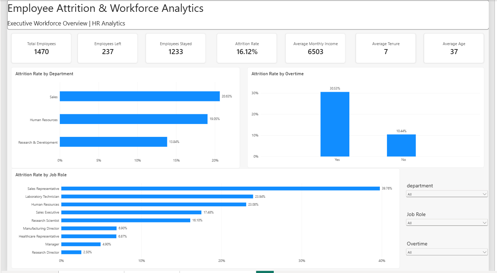
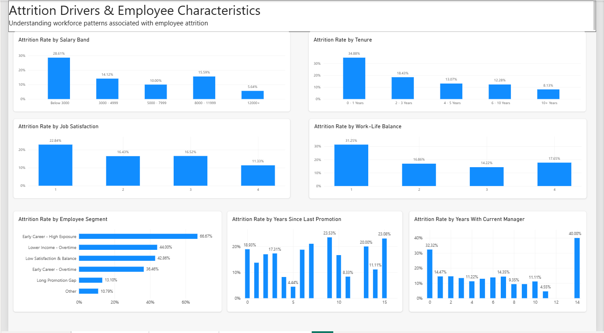
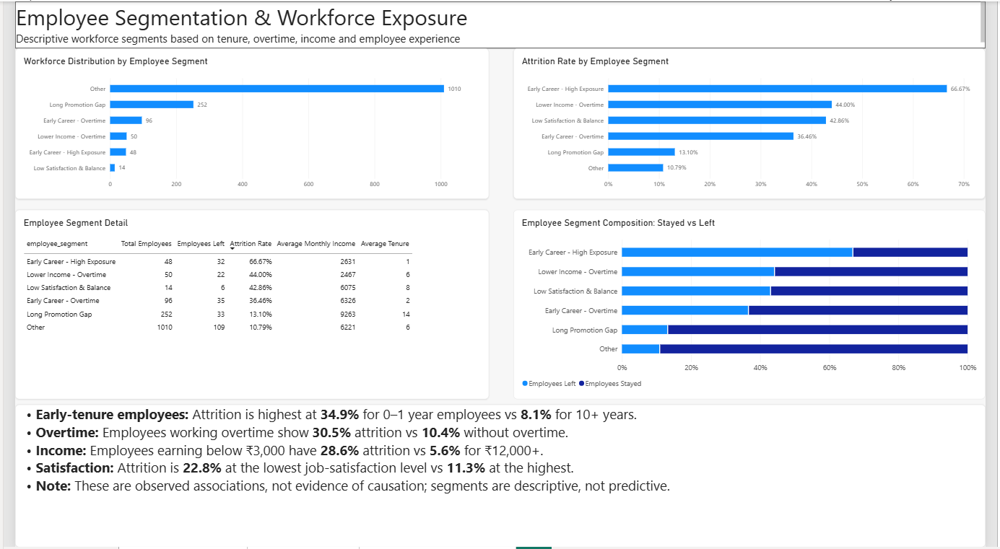

# Employee Attrition & Workforce Analytics

## 📌 Project Overview

Employee attrition is a major workforce challenge because employee turnover can affect productivity, staffing requirements, and organizational continuity.

This project analyzes employee workforce data to identify **patterns associated with employee attrition**, understand which employee groups have higher observed attrition rates, and provide an interactive Power BI dashboard for HR-focused workforce analysis.

The analysis combines **SQL, Python statistical analysis, and Power BI** to move from raw employee data to actionable workforce insights.

> **Important:** The dataset used in this project is the IBM HR Analytics Employee Attrition & Performance dataset, which is a fictional dataset. The findings represent patterns within this dataset and should not be interpreted as causal relationships or predictions of individual employee behavior.

---

## 🎯 Business Questions

The analysis focuses on the following questions:

- What is the overall employee attrition rate?
- Which departments have higher observed attrition?
- Which job roles show higher attrition rates?
- How is overtime associated with attrition?
- How do salary levels relate to observed attrition?
- How does tenure relate to attrition?
- How do job satisfaction and work-life balance relate to attrition?
- Which employee segments have higher observed attrition?
- Are the observed relationships statistically significant?

---

## 📊 Key Workforce Metrics

| Metric | Value |
|---|---:|
| Total Employees | 1,470 |
| Employees Left | 237 |
| Employees Stayed | 1,233 |
| Overall Attrition Rate | 16.12% |
| Average Monthly Income | 6,502.93 |
| Average Tenure | 7.01 years |
| Average Age | 36.92 years |

---

## 🔎 Key Findings

### Overtime

Employees working overtime had an observed attrition rate of **30.53%**, compared with **10.44%** among employees without overtime.

### Tenure

Employees with **0–1 years** at the company had an observed attrition rate of **34.88%**, compared with **8.13%** among employees with **10+ years** of tenure.

### Salary

Employees earning below 3,000 had an observed attrition rate of **28.61%**, compared with **5.64%** among employees earning 12,000+.

### Job Satisfaction

Observed attrition was **22.84%** at the lowest job-satisfaction level compared with **11.33%** at the highest level.

### Department

Observed attrition rates were:

- Sales: **20.63%**
- HR: **19.05%**
- R&D: **13.84%**

### Job Role

Sales Representatives had an observed attrition rate of approximately **39.76%**, while several senior roles had substantially lower observed attrition rates.

> These findings describe associations and observed patterns in the dataset. They do not establish that any individual factor causes employee attrition.

---

## 🧪 Statistical Analysis

Python was used to evaluate whether selected workforce characteristics were statistically associated with attrition.

### Tests Used

- Chi-Square Test of Independence
- Mann-Whitney U Test
- Cramer's V
- Rank-Biserial Correlation

### Statistically Significant Variables

The analysis found statistically significant associations between attrition and:

- Overtime
- Job Satisfaction
- Work-Life Balance
- Department
- Business Travel
- Marital Status
- Job Level
- Monthly Income
- Years at Company
- Age
- Total Working Years
- Years Since Last Promotion

Effect sizes were also calculated to provide additional context rather than relying only on statistical significance.

**Important:** Statistical significance does not imply causation.

---

## 👥 Employee Segmentation

Descriptive employee segments were created using combinations of:

- Tenure
- Overtime
- Monthly income
- Years since last promotion
- Job satisfaction
- Work-life balance

Example segments include:

- Early Career - High Exposure
- Early Career - Overtime
- Lower Income - Overtime
- Long Promotion Gap
- Low Satisfaction & Balance
- Other

These are **descriptive workforce segments**, not machine-learning predictions or individual employee risk scores.

---

## 📈 Power BI Dashboard

The Power BI dashboard contains three analytical pages.

### Dashboard Preview

#### Executive Overview


#### Attrition Drivers


#### Employee Segmentation


### 1. Executive Overview

Provides a high-level workforce view including:

- Total Employees
- Employees Left
- Employees Stayed
- Attrition Rate
- Average Monthly Income
- Average Tenure
- Average Age
- Attrition by Department
- Attrition by Overtime
- Attrition by Job Role

Interactive slicers allow users to analyze:

- Department
- Job Role
- Overtime

### 2. Attrition Drivers

Explores workforce characteristics associated with observed attrition:

- Salary Band
- Tenure
- Job Satisfaction
- Work-Life Balance
- Employee Segment
- Years Since Last Promotion
- Years With Current Manager

### 3. Employee Segmentation

Provides a deeper view of descriptive workforce segments:

- Workforce distribution by segment
- Attrition rate by segment
- Segment-level employee metrics
- Stayed vs Left composition
- Key workforce findings

---

## 🛠️ Tools & Technologies

### Data & Database
- MySQL
- SQL
- CSV

### Analytics
- Python
- Pandas
- NumPy
- SciPy

### Visualization & BI
- Microsoft Power BI
- DAX
- Matplotlib
- Seaborn

### Development Environment
- MySQL Workbench
- Power BI Desktop
- Python

---

## 🗂️ Project Structure

```
Employee Attrition & Workforce Analytics/
│
├── data/
│   └── WA_Fn-UseC_-HR-Employee-Attrition.csv
│
├── sql/
│   ├── 01_workforce_kpis.sql
│   ├── 02_attrition_drivers.sql
│   └── 03_employee_segments.sql
│
├── python/
│   ├── 01_employee_attrition_eda.py
│   ├── 02_attrition_statistical_analysis.py
│   ├── statistical_test_results.csv
│   ├── requirements.txt
│   └── README.md
│
├── dashboard/
│   ├── Employee_Attrition_Workforce_Analytics.pbix
│   ├── executive_overview.png
│   ├── attrition_drivers.png
│   └── employee_segmentation.png
│
├── README.md
└── Business_Insights.md
```

---

## 🔄 Analysis Workflow

```
Raw CSV Dataset
       ↓
MySQL Data Import
       ↓
Data Validation & Cleaning
       ↓
SQL Workforce Analysis
       ↓
Python EDA & Statistical Testing
       ↓
Descriptive Employee Segmentation
       ↓
Power BI Data Model
       ↓
DAX Measures
       ↓
Interactive Workforce Dashboard
       ↓
Business Insights
```

---

## 💡 Business Takeaways

The analysis highlights several workforce groups that warrant closer examination:

1. **Early-tenure employees** show substantially higher observed attrition than long-tenure employees.
2. **Overtime employees** show a considerably higher observed attrition rate.
3. **Lower-income employees** show higher observed attrition than higher-income groups.
4. **Lower job satisfaction and work-life balance levels** are associated with higher observed attrition.
5. Certain **departments and job roles** show different attrition patterns.

These findings can help HR teams identify areas for further investigation, such as onboarding, workload, compensation structure, career progression, and employee experience.

---

## ⚠️ Limitations

- The dataset is fictional and does not represent a specific real-world organization.
- The analysis identifies associations, not causal relationships.
- Employee segments are descriptive and are not predictive risk models.
- Results should not be generalized to other organizations without validation using relevant organizational data.
- Statistical significance should be interpreted together with effect size and business context.

---

## 📚 Dataset

**IBM HR Analytics Employee Attrition & Performance Dataset**

The dataset contains employee demographic, job, compensation, satisfaction, tenure, and attrition-related variables.

The dataset is commonly used for analytics and workforce-analysis demonstrations and is fictional.

---

## 👤 Author

**Saahil Nar**

Data Analyst | SQL | Power BI | Python | MySQL | Data Analytics

---

## ⭐ Project Objective

This project demonstrates an end-to-end analytics workflow:

**Data → SQL → Statistical Analysis → Segmentation → Power BI → Business Insights**

The objective is to demonstrate practical data-analysis skills rather than simply producing visualizations.
